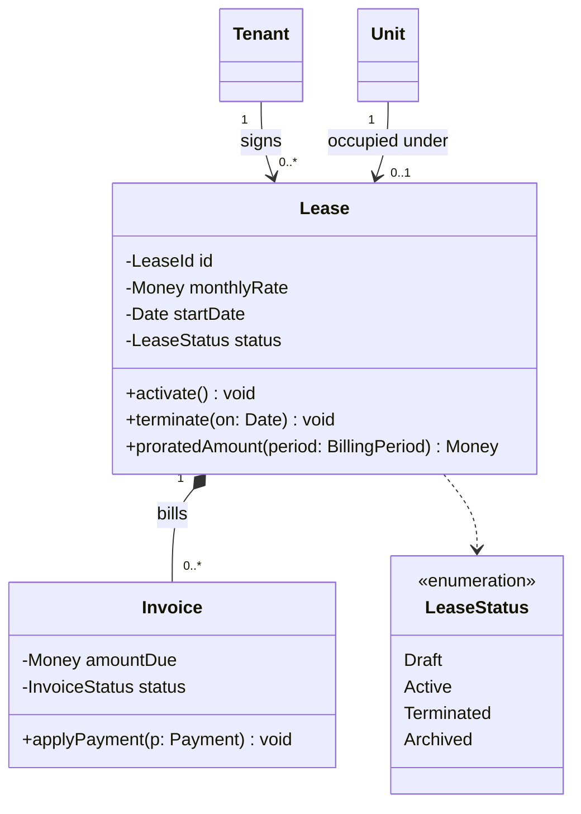
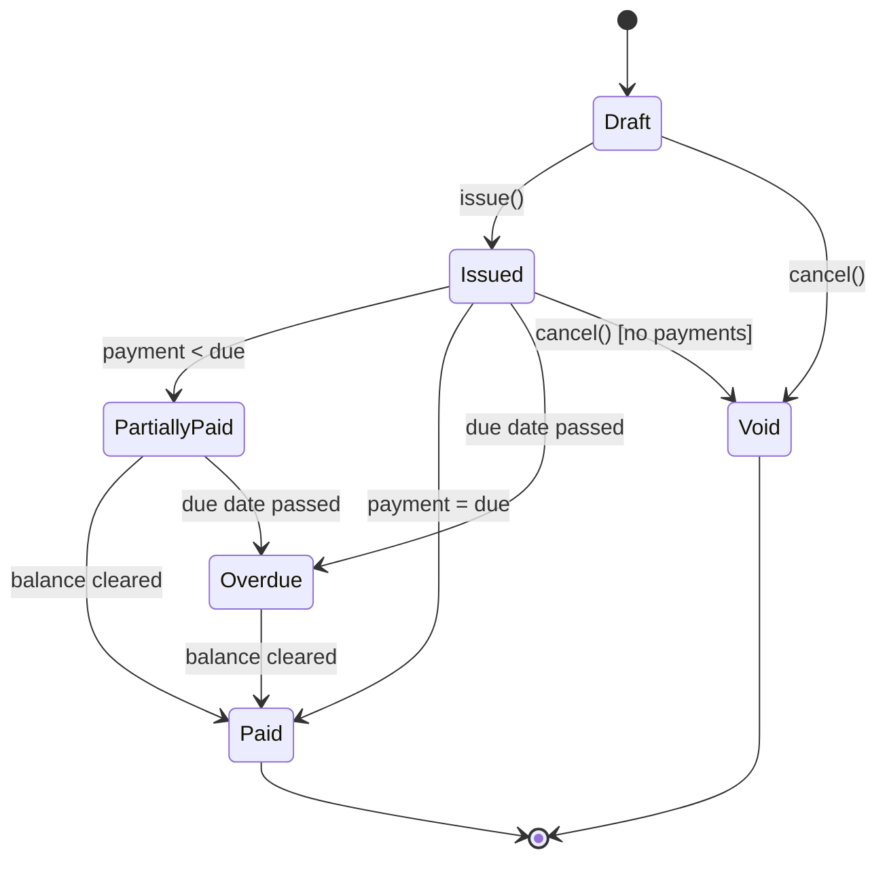
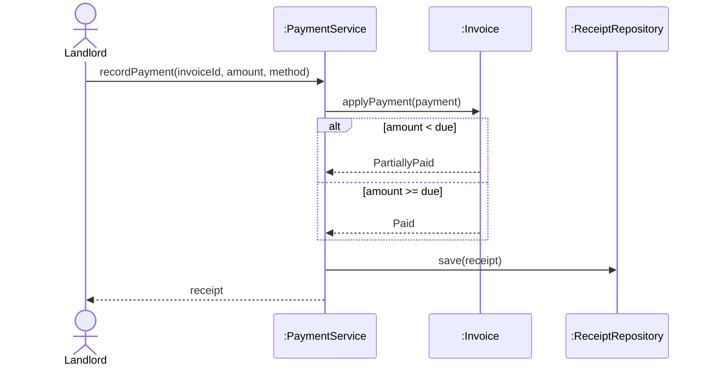
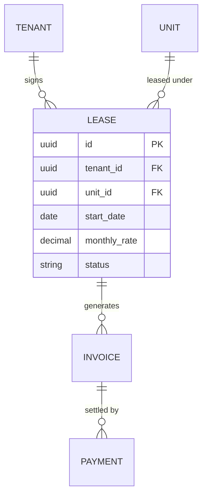
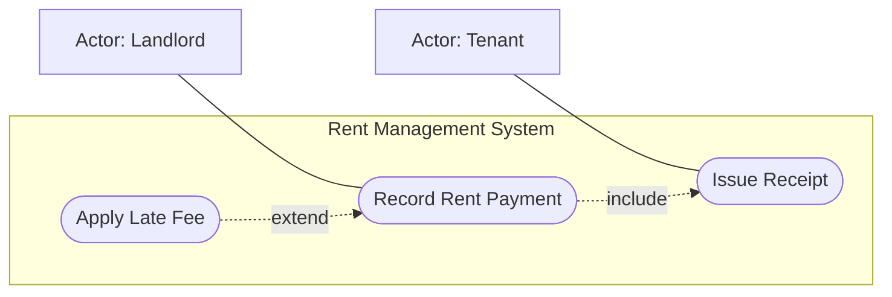
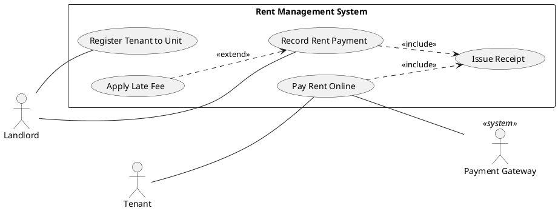

# Diagram syntax reference

Load this when producing draw.io XML, PlantUML, or any Mermaid diagram beyond the basics.
Pick the format by where the diagram will live:

| Need | Format |
|---|---|
| Renders inline in Markdown / GitHub, user edits as text | Mermaid |
| True UML use case notation, stereotypes, precise UML | PlantUML |
| User will open and rearrange it visually in diagrams.net | draw.io XML |

---

## Mermaid

### Class diagram



Relationship arrows:

- Inheritance: `Parent <|-- Child` (Child is-a Parent)
- Realization: `Interface <|.. Impl` (Impl implements Interface)
- Composition: `Whole *-- Part` (Part's lifecycle is owned by Whole)
- Aggregation: `Whole o-- Part` (Part can exist independently)
- Association: `A --> B` (A navigates to B)
- Dependency: `A ..> B` (A uses B transiently)

- Multiplicity goes in quotes on each side: `A "1" --> "0..*" B : label`.
- Generics use tildes: `List~Invoice~`.
- Visibility: `+` public, `-` private, `#` protected, `~` package.
- Stereotypes: `<<interface>>`, `<<abstract>>`, `<<enumeration>>` inside the class body.

### State machine



Put the guard or trigger on the transition label. The transitions are where the business
rules live, so every one needs a reason.

### Sequence diagram



For a system sequence diagram (analysis phase), treat the system as one black-box lifeline
(`:System`) and show only the actor's events crossing the boundary, plus any supporting
actors the system calls out to.

### ER diagram



Cardinality: `||` exactly one, `|o` zero or one, `}|` one or more, `}o` zero or more.
Derive the schema from the domain model. Don't draw the ERD first.

### Use case (approximation)

Mermaid has no use case diagram. Approximate with a flowchart and say that it's an
approximation:



### Mermaid gotchas

- Flowchart node labels containing `()`, `[]`, `{}` or `:` break the parser. Wrap the label in
  double quotes: `A["calc(total)"]`.
- `end` as a bare node id breaks flowcharts. Capitalize it or rename it.
- Class diagram members with generics must use `~T~`, not `<T>`.
- Don't mix `stateDiagram` and `stateDiagram-v2` syntax. Always use `-v2`.

---

## PlantUML

Use it when the user needs real UML use case notation.



- `<<include>>` arrow points from the base use case to the included one (always runs).
- `<<extend>>` arrow points from the extending use case to the base (conditional).
- Actor generalization: `Admin --|> Landlord`.
- Primary actors on the left and supporting actors on the right make it read correctly.

---

## draw.io (diagrams.net) XML

Output a complete `<mxfile>`. The user saves it as `name.drawio` and opens it in
diagrams.net, or uses Extras → Edit Diagram and pastes it in.

### Rules

1. Cells `0` and `1` are required. Every shape and edge uses `parent="1"`, except class
   compartment rows, which use their class cell as parent.
2. Every `id` is unique. Every edge's `source` and `target` points to an existing id.
3. Give every vertex explicit geometry: `x`, `y`, `width`, `height`. Snap to a 10px grid.
4. Escape XML in `value`: `&lt;` `&gt;` `&amp;` `&quot;`. With `html=1`, use `&lt;br&gt;` for
   line breaks.
5. Lay out before writing: actors in a column at x=60, the system boundary starting at
   x=160, use cases stacked inside with at least 30px vertical gap. Overlapping shapes mean
   the geometry was guessed.

### Use case diagram (complete example)

```xml
<mxfile host="app.diagrams.net">
  <diagram name="Use Cases" id="uc">
    <mxGraphModel dx="1000" dy="700" grid="1" gridSize="10" guides="1" tooltips="1" connect="1" arrows="1" fold="1" page="1" pageScale="1" pageWidth="1100" pageHeight="850" math="0" shadow="0">
      <root>
        <mxCell id="0"/>
        <mxCell id="1" parent="0"/>

        <mxCell id="sys" value="Rent Management System" style="rounded=0;whiteSpace=wrap;html=1;fillColor=none;verticalAlign=top;fontStyle=1;" vertex="1" parent="1">
          <mxGeometry x="160" y="40" width="360" height="330" as="geometry"/>
        </mxCell>

        <mxCell id="landlord" value="Landlord" style="shape=umlActor;verticalLabelPosition=bottom;verticalAlign=top;html=1;outlineConnect=0;" vertex="1" parent="1">
          <mxGeometry x="60" y="140" width="30" height="60" as="geometry"/>
        </mxCell>

        <mxCell id="uc1" value="Record Rent Payment" style="ellipse;whiteSpace=wrap;html=1;" vertex="1" parent="1">
          <mxGeometry x="200" y="90" width="150" height="60" as="geometry"/>
        </mxCell>
        <mxCell id="uc2" value="Issue Receipt" style="ellipse;whiteSpace=wrap;html=1;" vertex="1" parent="1">
          <mxGeometry x="340" y="190" width="150" height="60" as="geometry"/>
        </mxCell>
        <mxCell id="uc3" value="Apply Late Fee" style="ellipse;whiteSpace=wrap;html=1;" vertex="1" parent="1">
          <mxGeometry x="200" y="280" width="150" height="60" as="geometry"/>
        </mxCell>

        <mxCell id="e1" style="endArrow=none;html=1;" edge="1" parent="1" source="landlord" target="uc1">
          <mxGeometry relative="1" as="geometry"/>
        </mxCell>
        <mxCell id="e2" value="«include»" style="endArrow=open;dashed=1;endSize=12;html=1;" edge="1" parent="1" source="uc1" target="uc2">
          <mxGeometry relative="1" as="geometry"/>
        </mxCell>
        <mxCell id="e3" value="«extend»" style="endArrow=open;dashed=1;endSize=12;html=1;" edge="1" parent="1" source="uc3" target="uc1">
          <mxGeometry relative="1" as="geometry"/>
        </mxCell>
      </root>
    </mxGraphModel>
  </diagram>
</mxfile>
```

### Class (three-compartment box)

A class is a `swimlane` container with stacked child rows. Child `y` is relative to the
class, starting at `startSize` (the header height).

```xml
<mxCell id="lease" value="Lease" style="swimlane;fontStyle=1;align=center;verticalAlign=top;childLayout=stackLayout;horizontal=1;startSize=26;horizontalStack=0;resizeParent=1;resizeParentMax=0;resizeLast=0;collapsible=1;marginBottom=0;whiteSpace=wrap;html=1;" vertex="1" parent="1">
  <mxGeometry x="400" y="80" width="240" height="120" as="geometry"/>
</mxCell>
<mxCell id="lease-attrs" value="- monthlyRate: Money&lt;br&gt;- startDate: Date&lt;br&gt;- status: LeaseStatus" style="text;strokeColor=none;fillColor=none;align=left;verticalAlign=top;spacingLeft=4;spacingRight=4;overflow=hidden;rotatable=0;points=[[0,0.5],[1,0.5]];portConstraint=eastwest;whiteSpace=wrap;html=1;" vertex="1" parent="lease">
  <mxGeometry y="26" width="240" height="50" as="geometry"/>
</mxCell>
<mxCell id="lease-sep" style="line;strokeWidth=1;fillColor=none;align=left;verticalAlign=middle;spacingTop=-1;spacingLeft=3;spacingRight=3;rotatable=0;labelPosition=right;points=[];portConstraint=eastwest;strokeColor=inherit;" vertex="1" parent="lease">
  <mxGeometry y="76" width="240" height="8" as="geometry"/>
</mxCell>
<mxCell id="lease-ops" value="+ activate(): void&lt;br&gt;+ proratedAmount(p: BillingPeriod): Money" style="text;strokeColor=none;fillColor=none;align=left;verticalAlign=top;spacingLeft=4;spacingRight=4;overflow=hidden;rotatable=0;points=[[0,0.5],[1,0.5]];portConstraint=eastwest;whiteSpace=wrap;html=1;" vertex="1" parent="lease">
  <mxGeometry y="84" width="240" height="36" as="geometry"/>
</mxCell>
```

The class height must equal the sum of its rows (26 + 50 + 8 + 36 = 120).

### Relationship edge styles

| Relationship | `style` (append `html=1;`) | Direction |
|---|---|---|
| Association (navigable) | `endArrow=open;endFill=0;` | source → target |
| Inheritance | `endArrow=block;endFill=0;endSize=12;` | child → parent |
| Realization | `endArrow=block;endFill=0;dashed=1;endSize=12;` | impl → interface |
| Composition | `startArrow=diamondThin;startFill=1;startSize=14;endArrow=none;` | whole → part |
| Aggregation | `startArrow=diamondThin;startFill=0;startSize=14;endArrow=none;` | whole → part |
| Dependency | `endArrow=open;dashed=1;` | client → supplier |

### Multiplicity labels

Put them on child label cells of the edge. `x="-1"` anchors at the source end and `x="1"`
at the target end:

```xml
<mxCell id="e-lease-inv" style="startArrow=diamondThin;startFill=1;startSize=14;endArrow=none;html=1;" edge="1" parent="1" source="lease" target="invoice">
  <mxGeometry relative="1" as="geometry"/>
</mxCell>
<mxCell id="e-lease-inv-src" value="1" style="edgeLabel;resizable=0;html=1;align=left;verticalAlign=bottom;" vertex="1" connectable="0" parent="e-lease-inv">
  <mxGeometry x="-1" relative="1" as="geometry"><mxPoint x="6" y="-4" as="offset"/></mxGeometry>
</mxCell>
<mxCell id="e-lease-inv-tgt" value="0..*" style="edgeLabel;resizable=0;html=1;align=right;verticalAlign=bottom;" vertex="1" connectable="0" parent="e-lease-inv">
  <mxGeometry x="1" relative="1" as="geometry"><mxPoint x="-6" y="-4" as="offset"/></mxGeometry>
</mxCell>
```

Before handing over draw.io XML, check that it parses as XML, that ids are unique, that
edge endpoints exist, and that no two vertices overlap.
